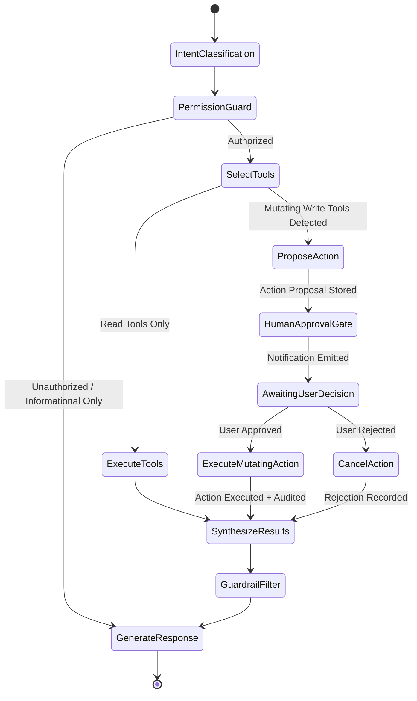

# NEXUS AI: AI, Agentic & Machine Learning Architecture

## 1. Executive Summary

NEXUS AI is built from the ground up as an **AI-Native Business Operating System**. 
Unlike superficial AI wrappers that simply wrap prompts around raw database dumps or send arbitrary SQL to an LLM, NEXUS AI employs:
1. **Deterministic Agent Workflows** via **LangGraph State Graphs**.
2. **Authorized & Schema-Validated Tool Calling** mapped to domain service boundaries.
3. **Strict Human-in-the-Loop (HITL) Action Proposals** for state mutations.
4. **Isolated Multi-Tenant RAG & Vector Retrieval** with strict organization isolation.
5. **Safe Read-Only NL-to-SQL Engine** guarded by SQL AST validation and schema allowlists.
6. **Domain Predictive ML Models** for churn, demand forecasting, and anomaly detection.

---

## 2. LLM Provider Abstraction Layer

The system decouples the entire application from specific AI vendors via the `BaseLLMProvider` interface:

```
                          ┌───────────────────────┐
                          │   BaseLLMProvider     │
                          │ - complete()          │
                          │ - stream()            │
                          │ - embed()             │
                          │ - call_tools()        │
                          └──────────┬────────────┘
                                     │
          ┌──────────────────────────┼──────────────────────────┐
          ▼                          ▼                          ▼
┌───────────────────┐      ┌───────────────────┐      ┌───────────────────┐
│  OpenAIProvider   │      │ AnthropicProvider │      │   LocalProvider   │
│ (GPT-4o, mini,    │      │ (Claude 3.5       │      │ (Ollama / vLLM    │
│  text-embedding-3)│      │  Sonnet / Haiku)  │      │  DeepSeek / Llama)│
└───────────────────┘      └───────────────────┘      └───────────────────┘
```

The active provider is configured through environment variables (`DEFAULT_LLM_PROVIDER=openai|anthropic|local`) without altering a single line of business or agent code.

---

## 3. LangGraph Agent Architecture

Complex multi-step reasoning and multi-tool orchestration use **LangGraph**.

### Agent State Definition
```python
class AgentState(TypedDict):
    organization_id: str
    user_id: str
    user_permissions: list[str]
    messages: list[BaseMessage]
    intent: str
    tool_calls: list[ToolCall]
    tool_results: list[dict]
    needs_human_approval: bool
    proposed_actions: list[dict]
    final_response: str
```

### Agent StateGraph Workflow


---

## 4. AI Tool Registry & Authorization Decorators

Tools are never invoked directly with arbitrary arguments. Every tool defines:
- **Pydantic V2 input schema**.
- **Permission requirement** checked against the active user's permissions.
- **Tenant Scope Enforcement**: The tool automatically receives `organization_id` from the secure context, never from LLM arguments.

### Example Tool Implementation
```python
@register_tool(
    name="get_customer_sales_summary",
    description="Retrieve aggregated sales, overdue invoices, and purchase recency for a customer.",
    required_permission="sales.read"
)
async def get_customer_sales_summary(
    params: CustomerSalesQueryParams,
    context: RequestContext
) -> CustomerSalesSummaryResult:
    # Context guarantees execution within context.organization_id
    service = SalesAnalyticsService(context.db_session, context.organization_id)
    return await service.get_customer_metrics(params.customer_id)
```

---

## 5. Safe Read-Only NL-to-SQL Engine

When complex ad-hoc analytics queries are requested, NEXUS AI employs a **controlled, sandboxed SQL pipeline**:

```
User Query: "Show top 5 customers with >20% revenue drop this quarter"
                              │
                              ▼
                 Schema Context Pruner
     (Injects only allowlisted analytics views, NO raw passwords/tokens)
                              │
                              ▼
                      LLM SQL Generator
                              │
                              ▼
                    SQL AST Validator (sqlglot)
    - Rejects INSERT, UPDATE, DELETE, DROP, ALTER, CREATE, TRUNCATE
    - Enforces mandatory `organization_id = :current_org_id` WHERE clause
    - Enforces LIMIT <= 100
                              │
                              ▼
            Read-Only Database Connection Pool (SELECT only)
                 Statement Timeout: 3000ms
                              │
                              ▼
            Structured Result Matrix -> Visualization Spec
```

---

## 6. Document RAG Pipeline (pgvector)

Documents uploaded to the Document Management Module (SOPs, contracts, price books, policies) are indexed and queried via a multi-tenant vector pipeline:

1. **Ingestion & Text Extraction**:
   - `pypdf`, `python-docx`, `openpyxl`, `csv`.
2. **Chunking**:
   - Recursive character chunking (500 tokens, 10% overlap).
   - Metadata tagging: `organization_id`, `document_id`, `title`, `chunk_index`, `permissions`.
3. **Embedding Generation**:
   - 1536-dimensional vectors via OpenAI `text-embedding-3-small` or local embedding models.
4. **Tenant-Strict Hybrid Retrieval**:
   - Cosine similarity vector search combined with PostgreSQL full-text search (`tsvector`), strictly bounded by `organization_id`.
   - Results formatted with verifiable citations and source excerpts.

---

## 7. Predictive Machine Learning Services (`backend/app/ml/`)

The ML pipeline is completely decoupled from API routing:

```
ml/
├── forecasting/        # Sales & Revenue Forecasting (ARIMA / Exponential Smoothing)
├── churn/              # Customer Churn Scoring (RFM features + Logistic Regression / XGBoost)
├── demand/             # Product Stockout Risk & Demand Prediction
├── anomaly/            # Isolation Forest for Expenses & Financial Outliers
├── feature_store/      # Reusable feature computation queries
└── registry/           # Model metadata, versioning, metrics, and artifact storage
```

### Models & Outputs:
1. **Sales Forecasting**: Evaluates historical sales daily/weekly/monthly to project 30-day revenue trends with confidence intervals.
2. **Customer Churn Risk**: Scores customers between `0.0` and `1.0` based on Recency, Frequency, Monetary (RFM) metrics and unresolved ticket interactions.
3. **Inventory Stockout Prediction**: Predicts days until stockout based on historical consumption velocity and supplier lead times:
   $$\text{Days Remaining} = \frac{\text{Current Available Stock}}{\text{Average Daily Velocity}}$$
4. **Expense Anomaly Detection**: Flags purchase order or journal entry amounts that deviate by $> 2.5 \sigma$ from historical category distributions.
