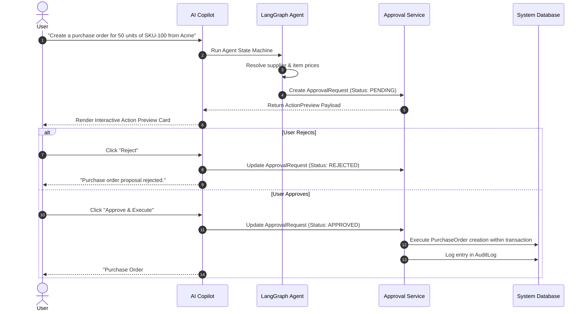

# NEXUS AI: System Architecture & Design Specification

## 1. High-Level Architecture Overview

**NEXUS AI** is designed on a **clean, modular, layered architecture** that decouples domain business logic, data persistence, AI/ML intelligence, and user presentation.

```
                    ┌──────────────────────────────────────────────┐
                    │               Client Layer                   │
                    │   Next.js 14 (App Router) + TypeScript       │
                    │   Tailwind CSS + Lucide + Recharts           │
                    └──────────────────────┬───────────────────────┘
                                           │ HTTPS / WSS
                                           ▼
                    ┌──────────────────────────────────────────────┐
                    │              Reverse Proxy                   │
                    │         NGINX / Caddy / Cloudflare           │
                    └──────────────────────┬───────────────────────┘
                                           │
             ┌─────────────────────────────┴─────────────────────────────┐
             ▼                                                           ▼
┌──────────────────────────────┐                         ┌──────────────────────────────┐
│       FastAPI Backend        │                         │      Background Worker       │
│  - REST API & SSE / WSS      │                         │  - Celery / ARQ Worker       │
│  - Auth & RBAC Middleware    │◄─────── Redis ─────────►│  - Scheduled ML Retraining   │
│  - Multi-Tenant Repository   │        Queue & Cache    │  - Document Chunk & Embed    │
│  - Business Service Layer    │                         │  - Report Generation         │
│  - AI Orchestrator Layer     │                         └──────────────┬───────────────┘
└──────────────┬───────────────┘                                        │
               │                                                        │
               ├────────────────────────────┬───────────────────────────┘
               ▼                            ▼
┌──────────────────────────────┐ ┌──────────────────────────────────────┐
│      PostgreSQL Database     │ │         External AI Providers        │
│  - Relational Schema         │ │  - OpenAI (GPT-4o, etc.)             │
│  - Row-Level Tenant Security │ │  - Anthropic (Claude 3.5 Sonnet)     │
│  - pgvector (Embeddings)     │ │  - Local LLMs (Ollama / vLLM)        │
│  - Strict Constraints & FKs  │ │  - SentenceTransformers / Embeddings │
└──────────────────────────────┘ └──────────────────────────────────────┘
```

---

## 2. Architectural Layers

### 2.1 Presentation Layer (`frontend/`)
- Built with **Next.js 14+ (App Router)** and **React 19** using modern React Server Components (RSC) and dynamic client-side interactions.
- Styled using **Tailwind CSS** with a custom enterprise design token system (dark/light themes, slate/zinc surfaces, indigo/violet primary accents).
- Dedicated **Copilot Workspace Drawer**:
  - Global collapsible slide-over and full-screen view.
  - Streaming conversational interface with real-time tool execution badges.
  - Safe interactive action preview cards with **Approve / Reject** buttons.
  - Interactive charts rendered from safe declarative JSON payloads (Recharts).

### 2.2 API & Ingress Layer (`backend/app/api/`)
- Built with **FastAPI** leveraging asynchronous I/O (`async`/`await`).
- Fully typed endpoints using **Pydantic v2** for request validation and response serialization.
- Middleware stack:
  - **Correlation ID Middleware**: Assigns a unique trace ID to every incoming request.
  - **Tenant Resolution Middleware**: Extracts active organization from JWT claims or headers, verifying tenant access.
  - **Rate Limiting Middleware**: Token bucket rate limiting backed by Redis.
  - **Audit Logging Middleware**: Intercepts mutating requests (POST, PUT, PATCH, DELETE) for audit recording.

### 2.3 Core Domain Service Layer (`backend/app/services/`)
- Encapsulates pure business rules and transaction logic independently of HTTP controllers.
- Coordinates database operations across multiple repositories within an atomic database transaction.
- Emits domain events upon state changes (e.g., `SalesOrderCreatedEvent`, `InvoicePaidEvent`, `StockThresholdBreachedEvent`).

### 2.4 Data Persistence & Repository Layer (`backend/app/repositories/`)
- Built with **SQLAlchemy 2.0 (Async Engine)** and **Alembic**.
- **Base Tenant Repository**:
  - Every tenant-scoped entity inherits from a common `TenantBaseModel` containing `organization_id`.
  - All read/write operations automatically apply `organization_id == current_tenant.id` filter clauses.
  - Prevents data leakage between organizations at the ORM compile level.

### 2.5 AI & Orchestration Layer (`backend/app/ai/`)
- Decoupled from specific model vendors using a **Provider Factory pattern**.
- Implements a **LangGraph State Machine** to structure LLM interactions into deterministic, observable steps:
  1. Intent Analysis
  2. Permission Evaluation
  3. Tool Selection & Validation
  4. Tool Execution & Output Sanitization
  5. Predictive & ML Synthesis
  6. Human-in-the-Loop Evaluation (Gating)
  7. Final Explanation Generation

---

## 3. Multi-Tenancy Architecture

NEXUS AI enforces **Logical Row-Level Isolation**:

```
+-------------------------------------------------------------------------+
|                              PostgreSQL                                 |
+-------------------------------------------------------------------------+
| Table: customers                                                        |
| +----+-----------------+--------------------+-------------------------+ |
| | id | organization_id | name               | email                   | |
| +----+-----------------+--------------------+-------------------------+ |
| | 1  | org_alpha       | Acme Corp          | billing@acme.com        | |
| | 2  | org_beta        | Beta Enterprises   | info@beta.com           | |
| +----+-----------------+--------------------+-------------------------+ |
+-------------------------------------------------------------------------+
       ▲                                 ▲
       │ Tenant Alpha Session            │ Tenant Beta Session
       │ (org_id = org_alpha)            │ (org_id = org_beta)
```

### Guarantees:
1. **Repository Injection**: Base queries enforce `SELECT ... WHERE organization_id = :org_id`.
2. **Compound Unique Constraints**: Keys spanning unique fields include `organization_id` (e.g., `UNIQUE(organization_id, sku)`).
3. **Foreign Key Integrity**: Child tables inherit and validate matching `organization_id` values.
4. **Vector Store Isolation**: Vector queries in `pgvector` enforce an unconditional metadata filter:
   ```sql
   SELECT id, content, cosine_distance(embedding, :query_vec)
   FROM document_chunks
   WHERE organization_id = :current_org_id
   ORDER BY embedding <=> :query_vec
   LIMIT :k;
   ```

---

## 4. Role-Based Access Control (RBAC)

Permissions follow a granular **Domain.Resource.Action** scheme:

| Role | Default Capabilities |
|---|---|
| **Super Admin** | Platform-wide administration, tenant onboarding, system diagnostics. |
| **Company Admin** | Full access to all modules within their own organization. |
| **Finance Manager** | `finance.*`, `sales.read`, `procurement.read`, `reports.*`. |
| **Sales Manager** | `crm.*`, `sales.*`, `inventory.read`, `customers.*`. |
| **Sales Executive** | `crm.read`, `crm.create`, `crm.update`, `sales.read`, `sales.create`. |
| **Inventory Manager** | `inventory.*`, `procurement.read`, `products.*`. |
| **HR Manager** | `hr.*`, `employees.*`, `leaves.*`, `attendance.*`. |
| **Employee** | `self.read`, `attendance.create`, `leaves.create`, `tasks.*`. |
| **Viewer** | Read-only access across assigned modules. |

### AI Permission Inheritance:
When a user interacts with the AI Copilot, the AI session executes strictly with the user's active permissions. If an `Employee` asks "What is the company's total profit this quarter?", the AI tool validator intercepts the request and refuses execution with an unauthorized permission notice.

---

## 5. Human-in-the-Loop (HITL) Workflow

AI write actions must never silently mutate the database:



---

## 6. Observability & Telemetry

NEXUS AI tracks operational telemetry across three pillars:
1. **Application Metrics**: Latency histograms, HTTP response codes, active database connections, background job queues.
2. **AI Telemetry**: Token consumption (prompt + completion), latency per model invocation, tool execution frequency, error rates.
3. **Audit Trail**: Append-only log recording every sensitive data mutation, state transition, and AI-approved action with actor identity, IP, and diff snapshots.
