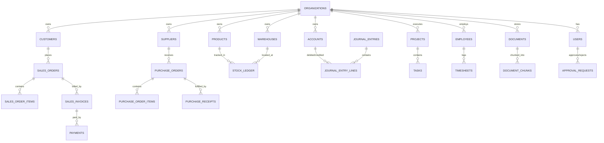

# NEXUS AI: Complete Database Design & Schema Specification

## 1. Overview & Principles

The NEXUS AI database is built on **PostgreSQL 16+** with the **pgvector** extension.
Key schema design principles:
- **Tenant Scoping**: All tenant-owned tables include `organization_id UUID NOT NULL REFERENCES organizations(id) ON DELETE CASCADE`.
- **Primary Keys**: UUIDv4 (`UUID DEFAULT gen_random_uuid()`) for distributed scalability and tamper resistance.
- **Audit Columns**: Every table inherits `created_at TIMESTAMPTZ`, `updated_at TIMESTAMPTZ`, `created_by UUID NULL`, and `is_deleted BOOLEAN DEFAULT FALSE` for soft deletes.
- **Strict Referential Integrity**: Foreign keys with indexed lookup columns, appropriate `ON DELETE` constraints, and composite unique constraints scoped to `organization_id`.
- **Financial Precision**: Money and quantities stored as `NUMERIC(18, 4)` to avoid floating-point inaccuracies.

---

## 2. Entity Relationship Diagram (High-Level Overview)

---

## 3. Core Tables Specification

### 3.1 Identity, Multi-Tenancy & RBAC

#### `organizations`
| Column | Type | Constraints | Description |
|---|---|---|---|
| `id` | UUID | PK, DEFAULT gen_random_uuid() | Primary key |
| `name` | VARCHAR(255) | NOT NULL | Organization name |
| `slug` | VARCHAR(100) | UNIQUE, NOT NULL | URL-safe identifier |
| `currency` | VARCHAR(3) | DEFAULT 'INR', NOT NULL | Base functional currency |
| `timezone` | VARCHAR(50) | DEFAULT 'Asia/Kolkata', NOT NULL | Organization timezone |
| `created_at` | TIMESTAMPTZ | DEFAULT NOW(), NOT NULL | Timestamp created |
| `updated_at` | TIMESTAMPTZ | DEFAULT NOW(), NOT NULL | Timestamp updated |

#### `users`
| Column | Type | Constraints | Description |
|---|---|---|---|
| `id` | UUID | PK, DEFAULT gen_random_uuid() | Primary key |
| `organization_id` | UUID | FK -> organizations(id), NOT NULL | Current active tenant |
| `email` | VARCHAR(255) | UNIQUE, NOT NULL | User login email |
| `hashed_password` | VARCHAR(255) | NOT NULL | Bcrypt / Argon2 hash |
| `first_name` | VARCHAR(100) | NOT NULL | First name |
| `last_name` | VARCHAR(100) | NOT NULL | Last name |
| `is_active` | BOOLEAN | DEFAULT TRUE, NOT NULL | Active status |
| `is_superuser` | BOOLEAN | DEFAULT FALSE, NOT NULL | Platform superuser flag |
| `created_at` | TIMESTAMPTZ | DEFAULT NOW(), NOT NULL | Creation timestamp |

#### `roles` & `permissions` & `user_roles`
- `roles`: `id`, `organization_id` (NULL for system roles), `name`, `description`.
- `permissions`: `id`, `code` (e.g. `sales.order.create`), `module`, `description`.
- `role_permissions`: `role_id`, `permission_id`.
- `user_roles`: `user_id`, `role_id`, `organization_id`.

#### `audit_logs`
| Column | Type | Constraints | Description |
|---|---|---|---|
| `id` | UUID | PK, DEFAULT gen_random_uuid() | Primary key |
| `organization_id` | UUID | FK -> organizations(id), NOT NULL | Tenant scoping |
| `actor_id` | UUID | FK -> users(id), NULL | Acting user or NULL if system |
| `action` | VARCHAR(100) | NOT NULL | E.g. `CREATE`, `UPDATE`, `APPROVE` |
| `resource_type` | VARCHAR(100) | NOT NULL | E.g. `SalesOrder`, `Invoice` |
| `resource_id` | VARCHAR(100) | NOT NULL | Primary key of changed resource |
| `before_state` | JSONB | NULL | Snapshot before mutation |
| `after_state` | JSONB | NULL | Snapshot after mutation |
| `is_ai_initiated` | BOOLEAN | DEFAULT FALSE | Flag if AI suggested action |
| `ip_address` | VARCHAR(45) | NULL | Client IP address |
| `created_at` | TIMESTAMPTZ | DEFAULT NOW(), NOT NULL | Timestamp |

---

### 3.2 CRM Module

#### `leads`
- `id`, `organization_id`, `first_name`, `last_name`, `email`, `phone`, `company_name`, `source`, `status` (`NEW`, `CONTACTED`, `QUALIFIED`, `UNQUALIFIED`, `CONVERTED`), `score` (FLOAT, AI calculated), `assigned_to` (FK -> users), `created_at`.

#### `customers`
- `id`, `organization_id`, `name`, `email`, `phone`, `billing_address` (JSONB), `shipping_address` (JSONB), `tax_identifier`, `credit_limit` (NUMERIC), `churn_risk_score` (FLOAT), `customer_segment` (`SMB`, `ENTERPRISE`, `STRATEGIC`), `created_at`.

#### `opportunities`
- `id`, `organization_id`, `customer_id` (FK), `name`, `stage` (`PROSPECTING`, `QUALIFICATION`, `PROPOSAL`, `NEGOTIATION`, `CLOSED_WON`, `CLOSED_LOST`), `amount` (NUMERIC), `probability` (FLOAT), `expected_close_date` (DATE), `assigned_to` (FK -> users).

#### `activities`
- `id`, `organization_id`, `entity_type` (`LEAD`, `CUSTOMER`, `OPPORTUNITY`), `entity_id` (UUID), `activity_type` (`CALL`, `MEETING`, `EMAIL`, `NOTE`, `FOLLOW_UP`), `summary`, `details`, `scheduled_at`, `completed_at`, `created_by`.

---

### 3.3 Products & Inventory Module

#### `products`
- `id`, `organization_id`, `sku` (VARCHAR, UNIQUE with org), `name`, `category`, `description`, `uom` (Unit of Measure), `standard_selling_price` (NUMERIC), `standard_cost_price` (NUMERIC), `reorder_level` (NUMERIC), `reorder_quantity` (NUMERIC), `is_stock_item` (BOOLEAN), `created_at`.

#### `warehouses`
- `id`, `organization_id`, `name`, `code`, `address` (JSONB), `is_active`.

#### `stock_ledger` (Immutable Inventory Transactions)
- `id`, `organization_id`, `product_id` (FK), `warehouse_id` (FK), `voucher_type` (`PURCHASE_RECEIPT`, `DELIVERY_NOTE`, `STOCK_TRANSFER`, `STOCK_ADJUSTMENT`), `voucher_id` (UUID), `quantity_delta` (NUMERIC, + or -), `valuation_rate` (NUMERIC), `balance_quantity` (NUMERIC), `balance_value` (NUMERIC), `batch_number`, `serial_number`, `created_at`.

---

### 3.4 Sales & Purchasing

#### `sales_orders` & `sales_order_items`
- `sales_orders`: `id`, `organization_id`, `order_number` (VARCHAR), `customer_id` (FK), `order_date` (DATE), `delivery_date` (DATE), `status` (`DRAFT`, `CONFIRMED`, `FULFILLED`, `CANCELLED`), `subtotal` (NUMERIC), `tax_total` (NUMERIC), `grand_total` (NUMERIC), `currency`.
- `sales_order_items`: `id`, `sales_order_id` (FK), `product_id` (FK), `quantity` (NUMERIC), `unit_price` (NUMERIC), `tax_rate` (NUMERIC), `subtotal` (NUMERIC).

#### `sales_invoices` & `payments`
- `sales_invoices`: `id`, `organization_id`, `invoice_number`, `customer_id` (FK), `sales_order_id` (FK NULL), `issue_date` (DATE), `due_date` (DATE), `status` (`DRAFT`, `UNPAID`, `PARTIALLY_PAID`, `PAID`, `OVERDUE`), `total_amount` (NUMERIC), `outstanding_amount` (NUMERIC).
- `payments`: `id`, `organization_id`, `invoice_id` (FK), `payment_date` (DATE), `amount` (NUMERIC), `payment_method` (`BANK_TRANSFER`, `CREDIT_CARD`, `UPI`, `CASH`), `reference_number`.

#### `suppliers` & `purchase_orders`
- `suppliers`: `id`, `organization_id`, `name`, `contact_name`, `email`, `phone`, `address` (JSONB), `payment_terms`.
- `purchase_orders`: `id`, `organization_id`, `po_number`, `supplier_id` (FK), `status` (`DRAFT`, `ISSUED`, `RECEIVED`, `BILLED`, `CANCELLED`), `total_amount` (NUMERIC), `created_at`.
- `purchase_order_items`: `id`, `purchase_order_id` (FK), `product_id` (FK), `quantity` (NUMERIC), `unit_price` (NUMERIC), `subtotal` (NUMERIC).

---

### 3.5 Finance & Double-Entry Accounting

#### `chart_of_accounts`
- `id`, `organization_id`, `account_code` (VARCHAR), `name` (VARCHAR), `account_type` (`ASSET`, `LIABILITY`, `EQUITY`, `INCOME`, `EXPENSE`), `parent_id` (FK -> chart_of_accounts NULL), `is_group` (BOOLEAN).

#### `journal_entries` & `journal_entry_lines`
- `journal_entries`: `id`, `organization_id`, `entry_number`, `posting_date` (DATE), `reference_type` (`SALES_INVOICE`, `PURCHASE_INVOICE`, `PAYMENT`, `MANUAL`), `reference_id` (UUID NULL), `narration` (TEXT), `total_debit` (NUMERIC), `total_credit` (NUMERIC, must match total_debit).
- `journal_entry_lines`: `id`, `journal_entry_id` (FK), `account_id` (FK), `debit` (NUMERIC DEFAULT 0), `credit` (NUMERIC DEFAULT 0), `cost_center_id` (FK NULL).

---

### 3.6 HR, Attendance & Projects

#### `employees`
- `id`, `organization_id`, `user_id` (FK NULL), `employee_code`, `first_name`, `last_name`, `email`, `department_id` (FK), `designation`, `date_of_joining` (DATE), `status` (`ACTIVE`, `ON_LEAVE`, `TERMINATED`).

#### `projects` & `tasks`
- `projects`: `id`, `organization_id`, `name`, `code`, `customer_id` (FK NULL), `status` (`PLANNING`, `ACTIVE`, `ON_HOLD`, `COMPLETED`), `budget` (NUMERIC), `start_date` (DATE), `end_date` (DATE).
- `tasks`: `id`, `organization_id`, `project_id` (FK), `title`, `description`, `status` (`TODO`, `IN_PROGRESS`, `REVIEW`, `DONE`), `priority` (`LOW`, `MEDIUM`, `HIGH`, `URGENT`), `assigned_to` (FK -> users NULL), `due_date` (DATE).

---

### 3.7 Document Management & Vector RAG (pgvector)

#### `documents`
- `id`, `organization_id`, `title` (VARCHAR), `file_path` (VARCHAR), `file_type` (`PDF`, `DOCX`, `TXT`, `CSV`, `XLSX`), `file_size` (INT), `uploaded_by` (FK -> users), `created_at`.

#### `document_chunks`
- `id`, `organization_id`, `document_id` (FK -> documents ON DELETE CASCADE), `chunk_index` (INT), `content` (TEXT), `token_count` (INT), `embedding` (VECTOR(1536)), `metadata` (JSONB).
- **Index**: `CREATE INDEX idx_chunks_vector ON document_chunks USING hnsw (embedding vector_cosine_ops);`
- **Index**: `CREATE INDEX idx_chunks_org ON document_chunks (organization_id);`

---

### 3.8 Human-in-the-Loop & Approval System

#### `approval_requests`
| Column | Type | Constraints | Description |
|---|---|---|---|
| `id` | UUID | PK, DEFAULT gen_random_uuid() | Unique ID |
| `organization_id` | UUID | FK -> organizations(id), NOT NULL | Tenant scoping |
| `requester_id` | UUID | FK -> users(id), NULL | User or NULL (if agent) |
| `action_type` | VARCHAR(100) | NOT NULL | E.g. `CREATE_PURCHASE_ORDER` |
| `payload` | JSONB | NOT NULL | Proposed parameters |
| `status` | VARCHAR(50) | DEFAULT 'PENDING' | `PENDING`, `APPROVED`, `REJECTED` |
| `explanation` | TEXT | NOT NULL | Reason why action is proposed |
| `reviewed_by` | UUID | FK -> users(id), NULL | Approving user ID |
| `reviewed_at` | TIMESTAMPTZ | NULL | Timestamp of review |
| `execution_result`| JSONB | NULL | Result of action execution |
| `created_at` | TIMESTAMPTZ | DEFAULT NOW(), NOT NULL | Request timestamp |
